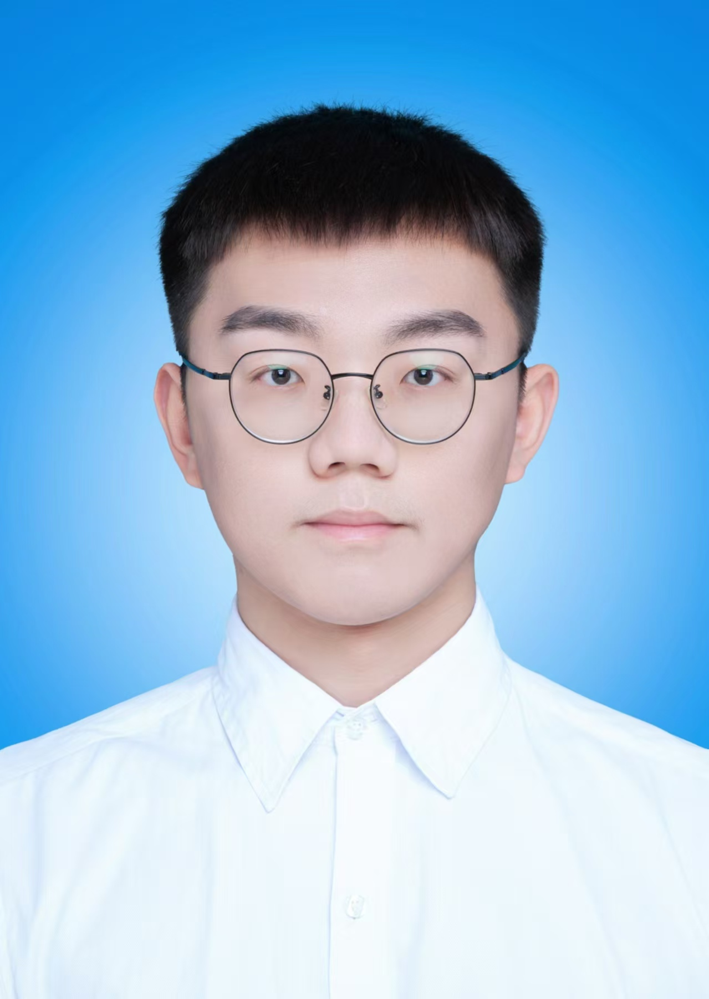

# About Me

<!--  -->

Here is **Yuhao Du (杜宇豪)**. 

I am currently a Phd student in the [Intelligent Transportation Research Center](https://its.whut.edu.cn/) at Wuhan University of Technology，supervised by [Prof. Yi HE](https://its.whut.edu.cn/?jiaoshifengcai/844.html).I graduated from the Department of Traffic Engineering at East China Jiaotong University in 2022 with a Bachelor of Engineering degree. In the same year, began pursuing a Master of Engineering degree at the Intelligent Transportation Systems Research Center of Wuhan University of Technology, specializing in motion planning for autonomous vehicles.

Before my Phd stage, I have been working on the topic of autonomous driving using Nolinear Planning. I am highly interested in cutting-edge fields such as end-to-end autonomous driving, diffusion models, and large model-guided vehicle motion planning. I am convinced that key next-generation technologies—including large models, end-to-end approaches, and diffusion models—will empower the vehicle-road-cloud integrated intelligent transportation systems, bringing revolutionary changes to traditional traffic and making L4-level autonomous driving achievable.

Specifically, my doctoral research will focus on autonomous vehicles, with an emphasis on motion planning. I aim to explore the application of new artificial intelligence technologies in planning and control, ultimately achieving the integration of intelligent transportation systems and autonomous driving.

If you are interested in any aspect of me, I am always open to discussions and academic collaborations. Feel free to reach out to me at — **yuhao_du [at] whut.edu.cn**

---

## Research Interests

- Diffusion Model
- End 2 End Autonomous Driving
- Large Language Model Agents
- Vehicle Motion Planning

---

## News and Updates

- **June 2025**：**Awarded Outstanding Master's Graduate** by Wuhan University of Technology
- **June 2025**：Successfully passed the master's thesis defense and was awarded a Master of Engineering degree.
- **November 2024**：**First Place**​​, Virtual-Real Integration Autonomous Driving Challenge
- **June 2024**：**First Place**​​, OnSite Autonomous Driving Algorithm Challenge – Parking Specialty Competition
- **June 2023**：**Third Place**​​, OnSite Autonomous Driving Algorithm Challenge – Merging & Exiting Specialty Competition
- **June 2023**：**Tenth Place**​​, OnSite Autonomous Driving Algorithm Challenge – Basic Highway Specialty Competition

 

<!-- <blockquote class="twitter-tweet">
Thrilled to be an AAAI-UC Scholar at <a href="https://twitter.com/hashtag/AAAI24?src=hash&amp;ref_src=twsrc%5Etfw">#AAAI24</a>, thanks to <a href="https://twitter.com/hashtag/AAAI?src=hash&amp;ref_src=twsrc%5Etfw">#AAAI</a> &amp; <a href="https://twitter.com/hashtag/GoogleExploreCSR?src=hash&amp;ref_src=twsrc%5Etfw">#GoogleExploreCSR</a> for the sponsorship. Grateful for the knowledge gained and new friendships formed.  Wonderful trip in Vancouver. Looking forward to staying connected with all.<a href="https://twitter.com/hashtag/AAAI24?src=hash&amp;ref_src=twsrc%5Etfw">#AAAI24</a> <a href="https://twitter.com/hashtag/Vancouver?src=hash&amp;ref_src=twsrc%5Etfw">#Vancouver</a> <a href="https://twitter.com/hashtag/GoogleExploreCSR?src=hash&amp;ref_src=twsrc%5Etfw">#GoogleExploreCSR</a> <a href="https://t.co/wUQUp8XlSM">pic.twitter.com/wUQUp8XlSM</a>
&mdash; Hanlin CAI (seeking a PhD position 2025) (@lancecai2002) <a href="https://twitter.com/lancecai2002/status/1762210025173344260?ref_src=twsrc%5Etfw">February 26, 2024</a></blockquote>  -->

